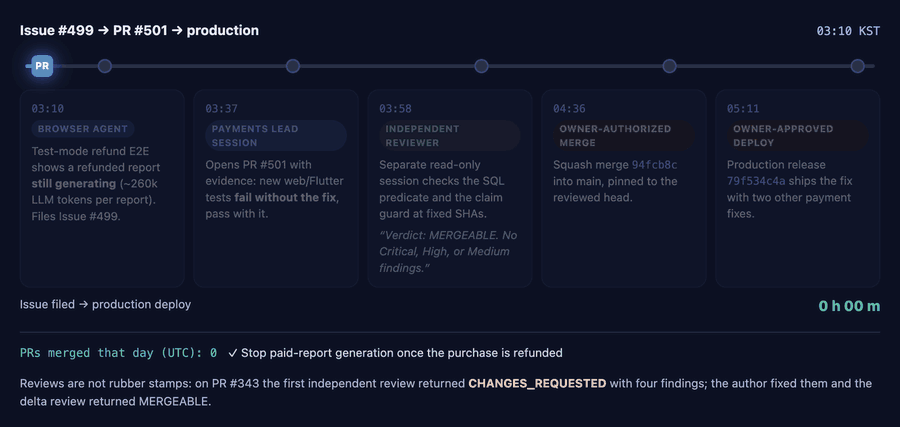
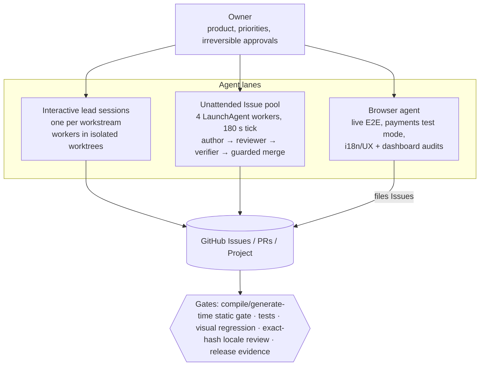

# One Engineer, an Agent Team: How I Ship a Production Product with AI Agents

*Replay from real repository timestamps (KST, 2026-10-07): a browser agent finds a bug, a lead session opens the fix, a separate reviewer approves at fixed SHAs, the owner authorizes merge and deploy. Issue to production deploy: 2 h 01 m.*

**Code (reference implementation):** https://github.com/mg-mg-mg/agentic-delivery-kit, a public-safe, configurable version of the dispatcher, lease, guards, and navigation eval, with 108 tests.

**Visual version (one page):** https://mg-mg-mg.github.io/agentic-engineering/

*Mingyun Chae, October 2026. Case study of the delivery system behind [TriAstra](https://triastra.ai) and a client engagement in Singapore. Product source code is private; this document describes the process, not the product code.*

## TL;DR

I run software delivery as a small organization in which AI agents do almost all of the implementation, review, verification, and bookkeeping, and I act as owner, architect, and final authority on irreversible decisions. What matters is what it changed:

| Impact | Evidence |
| --- | --- |
| A full product shipped and run by one person | 7 languages on the web and as a ChatGPT app; 1,600+ registered users; ~130 new sign-ups a week |
| Bugs are fixed in hours, not sprints | Median 1.9 h from bug report to merged fix (24 bugs, Sep 7 - Oct 8, 2026); one billing bug went from browser-agent discovery to production deploy in 2 h 01 m, stopping ~260k wasted LLM tokens per refunded report |
| Speed without lowering the bar | Independent AI reviewers sent back 19% of PRs (45 of 231) before merge; 0 of 231 merged PRs reverted; median 22 minutes from PR opened to merged; 3,600+ server tests; nothing unattended can deploy, move money, or touch production data |
| A client got a working product, not a mockup | A Singapore startup-accelerator operator's spreadsheet-only process became a working server and 3 role-based portals, with all 15 prototype screens replaced by real ones in 6 days, delivered for the client's pilot; client rating 5.0/5 |
| Team-level output at subscription cost | The whole development system runs on two flat-rate AI subscriptions (production LLM and cloud costs are separate) |
| Better tools for other engineers | My accuracy eval found 3 defects in CodeGraph (73k+ stars), all fixed upstream; the harness is open source as agentic-delivery-kit |

Throughput, as supporting evidence only: 10,143 commits since 2026-01-05; 34-45 independently reviewed PRs merged per day (Oct 3-6, 2026); 702 PRs merged in 30 days on the client project (median 1.3 h); a 2-4 minute pre-merge E2E smoke gate in place of the 33-minute full suite minutes.

## 1. The operating principle: owner attention is the scarcest resource

The repository's root contract (`AGENTS.md`, about 63 KB plus nested files and task skills) starts from one rule: an agent that stops to ask for a decision it could make itself costs more than a reversible mistake that it catches and fixes.

Decision rights are explicit:

| Decision | Who decides |
| --- | --- |
| Technical design, root-cause scope, refactoring, slicing, test strategy, task order | Agent decides, acts, reports the reason |
| Defects found while working, tooling recovery, Issues, labels, branches, worktrees, PRs, docs and rule updates | Agent acts, then records |
| Deployment, store submission, payments, production data writes, external messages, spending, credentials | Owner, asked once with a recommendation |
| Product direction, pricing, user-facing policy, final Korean copy | Owner, asked once; agent keeps working on everything else |

Agents "work the queue": when a task ends they start the next authorized one instead of asking "what next?". Reports have three parts: done (with evidence), started next, needs an owner decision.

## 2. The system

### 2.1 Interactive lead sessions

Each workstream has a long-lived lead session in a terminal agent harness. Tooling evolved with the work: TriAstra started on Codex and Claude Code, moved through Oh My Pi (omp) and jcode, and has now consolidated on omp; the client engagement also used Codex and then omp. The rules live in the repository, not in a tool, so switching harnesses did not reset the process. A lead owns design, integration, and final verification, and delegates bounded slices to at most two workers, each in its own git worktree with explicit file ownership, acceptance criteria, and a stop condition. Generated surfaces (OpenAPI clients, SQLx metadata, l10n files, fixtures) get exactly one owner lane per task so agents never fight over the same files.

### 2.2 The unattended Issue pool

Four macOS LaunchAgent workers wake every 180 seconds and each claims at most one unowned P1/P2 bug or maintenance Issue from a complete Project/PR/dependency snapshot. Payment work, Owner holds, unresolved dependencies, and anything already owned by a branch or PR are excluded. For each claim:

1. **Author**: a coding model runs in an offline, minimal-read worktree sandbox with no GitHub or provider credentials and no access to secrets. It can implement and run local checks, but cannot commit, push, or reach the network.
2. **Trusted dispatcher**: validates Issue and Project state, stages and reviews the diff with the trusted review script, disables candidate git hooks, publishes the PR, and verifies the exact remote head.
3. **Independent reviewer**: a separate read-only model process reviews the fixed head/base SHAs against the current Issue acceptance criteria and chooses which checks are needed.
4. **Verifier**: a separate credentialless process runs those checks and must leave the reviewed head and worktree unchanged.
5. Findings or failures go back to the same author lane. Every revision needs a new head, a fresh review, and passing verification. The loop runs until mergeable or a five-hour budget expires.
6. **Guarded merge**: the dispatcher saves a merge intent, squash-merges pinned to the reviewed head, then verifies parent, tree, and Issue state, and posts the risk verdict, exact commands, exit codes, and remaining criteria to the PR.

Nothing unattended can deploy, submit to app stores, touch production data, move money, change credentials, or send external messages.

### 2.3 A browser agent as a teammate

A browser agent (Aside) handles everything that needs a real logged-in browser: end-to-end payment flows in test mode (checkout, refund, period-end cancel, revoke), live i18n and UX audits across all locales, and read-only audits of ops, analytics, and observability dashboards. It talks to the coding sessions through a file mailbox inside the repository and a local control channel of the harness, and turns findings into GitHub Issues that the coding lanes pick up. One example: during a payments migration it found that refunded reports kept generating (about 260k LLM input tokens per report). That became an Issue, was fixed by a coding lane, and was deployed the same day.

### 2.4 Context for agents, with measured trust

Agents navigate the codebase through two local code-intelligence tools: **CodeGraph** (symbol, call, import, and route lookup, served to the coding harness over MCP) and **Understand Anything** (an on-demand visual explanation of one subdirectory). Both are installed from checksum-pinned releases into a user cache, never via upstream installers that rewrite agent configs; telemetry and update checks are off; and a read boundary keeps credentials, key stores, Terraform state, and private data out of the index, with a test that keeps both tools' exclusion lists aligned.

I don't take the tools on faith. An evaluation script scores the index against ground truth built from source (every handler bound in the router, word-bounded usages, curated direct calls) and fails if a metric drops below baseline. It found that route-to-handler recall was **8.5% (31 of 364)** because of an upstream defect with multi-line routes. The repository rule that follows: graph output is a navigation lead, not evidence; every caller, impact set, and route is confirmed in source before editing.

## 3. The gates that make speed safe

- **Find errors at compile, analyze, or generation time, not at runtime.** A single cross-language static gate covers Rust, generated API clients, Flutter, TypeScript, Python, Shell, and Terraform. Contract-first REST APIs generate typed clients so API drift fails the build.
- **Author-reported green checks never count.** Review and verification must be reproduced by a different process at fixed SHAs, even for a docs-only PR.
- **Root cause plus a ratchet.** A fix is done only when the root cause is named and a regression test, ratchet, or gate stops it from returning.
- **Visual regression** with deterministic Flutter goldens and Chromium screenshots of app, widget, and public pages.
- **Locale quality gate:** for AI-managed locales, a string ships only after seven independent locale passes over the exact text hash; the owner natively reviews Korean.
- **Concurrency guards:** Cargo build slots shared across worktrees, a fail-closed lease on `main` for release and integration, `--force-with-lease` with an observed SHA for any history rewrite, serialized merges.
- **Evidence over claims:** every report states the commands run, observed results, and checks that could not run. Unverified claims are labeled as such.

## 4. What I learned

1. **Throughput is cheap; trust is expensive.** The bottleneck moved from writing code to defining acceptance criteria and building gates that make agent output trustworthy without me reading every line.
2. **Separate the roles.** The same model reviewing its own work misses the same things. Separate author, reviewer, and verifier processes with different permissions catch far more.
3. **Least privilege for agents.** The author needs no network and no secrets. Credentials live only in the trusted dispatcher, and only for the specific write it is about to make.
4. **Write the rules where agents read them.** Decision rights, workflows, and domain facts live in versioned repo docs, so every new session starts with the same contract and rules improve through PRs.
5. **Spend human attention on the irreversible.** I approve deployments, payments, pricing, and user-facing policy. Almost everything else is delegated and audited.

## 5. Same system, client context

On a one-month on-site contract for a Singapore startup-accelerator B2B platform (existing Django + React codebase), the same approach (run on oh-my-pi after starting on Codex) let me act as the sole full-stack engineer: a spreadsheet-only process became a 15-screen prototype, then a real server and three role-based portals, with every prototype screen replaced by a real one in six days; I built a meeting engine (availability, booking locks, reschedule state machine, time zones and DST, .ics), locked down 15 unauthenticated APIs and tiered 30 write APIs, removed all 156 legacy server-rendered templates (11.5k lines), and added a 2-4 minute pre-merge E2E smoke gate in place of the 33-minute full suite. 715 PRs authored, 702 merged, client rating 5.0/5.

---

Contact: coalsrbs7@gmail.com · GitHub [mg-mg-mg](https://github.com/mg-mg-mg)
