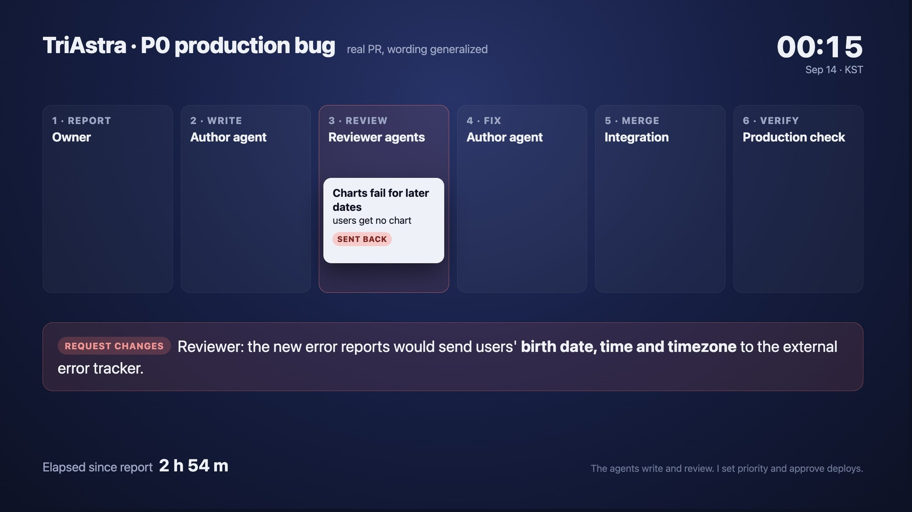
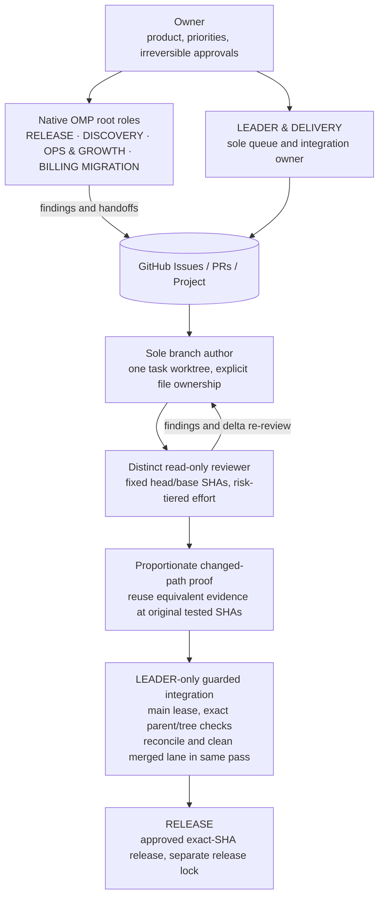
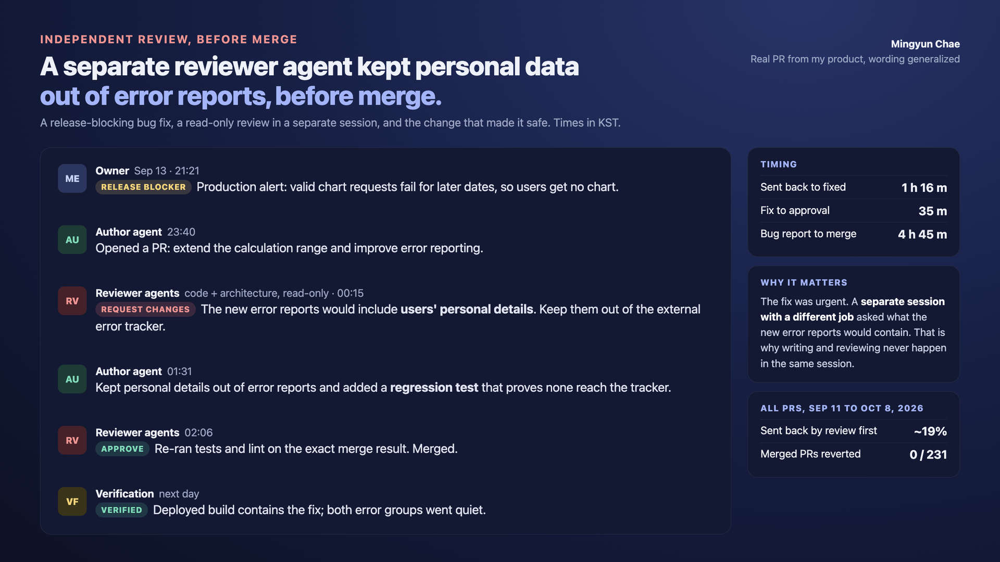

# One Engineer, an Agent Team: How I Ship a Production Product with AI Agents

▶ **[Watch the 39-second video](https://mg-mg-mg.github.io/agentic-engineering/#watch)**: a release-blocking chart bug, a separate reviewer agent that kept personal data out of error reports, the fix, merge and next-day production verification. Real timestamps, wording generalized. [Text equivalent of the video and evidence card](https://mg-mg-mg.github.io/agentic-engineering/#review-transcript).

*A different example: the refund replay uses real repository timestamps (KST, 2026-10-07). A browser agent finds a bug, a lead session opens the fix, a separate reviewer approves at fixed SHAs, and the owner authorizes merge and deploy. Issue to production deploy: 2 h 01 m.*

**Code (historical reference implementation):** https://github.com/mg-mg-mg/agentic-delivery-kit, a public-safe, configurable version of the retired dispatcher, lease, guards, and navigation eval, with 108 tests.

**Visual version (one page):** https://mg-mg-mg.github.io/agentic-engineering/

*Mingyun Chae, October 2026. Case study of the delivery system behind [TriAstra](https://triastra.ai) and a client engagement in Singapore. Product source code is private; this document describes the process, not the product code.*

## TL;DR

I run software delivery as a small organization in which AI agents do almost all of the implementation, review, verification, and bookkeeping, and I act as owner, architect, and final authority on irreversible decisions. What matters is what it changed:

| Impact | Evidence |
| --- | --- |
| A full product shipped and run by one person | 7 languages on the web and as a ChatGPT app; 1,600+ registered users; ~130 new sign-ups a week |
| Bugs are fixed in hours, not sprints | Median 1.9 h from bug report to merged fix (24 bugs, Sep 7 - Oct 8, 2026); one billing bug went from browser-agent discovery to production deploy in 2 h 01 m, stopping ~260k wasted LLM tokens per refunded report |
| Speed without lowering the bar | Independent AI reviewers sent back 19% of PRs (45 of 231) before merge; 0 of 231 merged PRs reverted; median 22 minutes from PR opened to merged; 3,600+ server tests; nothing unattended can deploy, move money, or touch production data |
| A client got a working product, not a mockup | A Singapore client's manual workflow became a working server and 3 role-based portals, with all 15 prototype screens replaced by real ones in 6 days, delivered for the client's pilot; client rating 5.0/5 |
| Better tools for other engineers | My accuracy eval found 3 defects in CodeGraph (73k+ stars), all fixed upstream; the harness is open source as agentic-delivery-kit |

Throughput, as supporting evidence only: 10,143 commits since 2026-01-05; 34-45 independently reviewed PRs merged per day (Oct 3-6, 2026); 668 PRs merged in September on the client project; a 2-4 minute pre-merge E2E smoke gate on every PR.

Current workflow as of October 10, 2026; outcome snapshots through October 8. Review figures cover Sep 11–Oct 8; bug timing covers Sep 7–Oct 8. Other windows are stated beside each figure.

## 1. The operating principle: owner attention is the scarcest resource

The repository's root contract (`AGENTS.md`, about 63 KB plus nested files and task skills) starts from one rule: an agent that stops to ask for a decision it could make itself costs more than a reversible mistake that it catches and fixes.

Decision rights are explicit:

| Decision | Who decides |
| --- | --- |
| Technical design, root-cause scope, refactoring, slicing, test strategy, task order | Agent decides, acts, reports the reason |
| Defects found while working, tooling recovery, Issues, labels, branches, worktrees, PRs, docs and rule updates | Agent acts, then records |
| Deployment, store submission, payments, production data writes, external messages, spending, credentials | Owner, asked once with a recommendation |
| Product direction, pricing, user-facing policy, final Korean copy | Owner, asked once; agent keeps working on everything else |

Agents "work the queue": when a task ends they start the next authorized one instead of asking "what next?". Reports have three parts: done (with evidence), started next, needs an owner decision.

## 2. The system

### 2.1 Current system: native OMP

TriAstra started on Codex and Claude Code, moved through Oh My Pi (omp) and jcode, and has now consolidated on omp; the client engagement also used Codex and then omp. The rules live in the repository, not in a tool.

The root roles are **LEADER & DELIVERY**, **RELEASE**, **DISCOVERY**, **OPS & GROWTH**, and **BILLING MIGRATION**. These define ownership, not a claim that every role is running. Specialists hand off to the sole LEADER, which owns queue admission, integration, merge and cleanup.

Each Issue/PR has one branch author and a distinct read-only reviewer at fixed head/base SHAs. Review effort follows the highest matching risk tier: sensitive contracts, security, payments and delivery/governance get the configured high effort; other product code and scripts get medium; low applies only when every path qualifies. Revisions go back to the original reviewer for delta review while available.

Before creating a worktree, inspect existing lanes, claims and prerequisites. Fetch through the existing guard, create or reuse one task-specific lane from the integration head, record its starting SHA, and verify checkout identity, clean status and the authorized environment link. No duplicate lanes or stacked task branches; dependencies wait for main. Generated surfaces have exactly one owner lane.

Capacity follows actual host authorization and measured memory headroom, not a fixed worker count. The LEADER integrates under the main lease, checks the exact reviewed head/base and resulting parent/tree, reconciles the Issue/Project, then cleans the merged lane in the same pass after preservation checks. Every sweep also reconciles older merged lanes; failed cleanup checks leave the lane intact with a recorded reason. Releases use a separate lock and a pinned checkout, not the main lease.

Trusted OMP configuration is **not an enforced sandbox**. Actual host permissions, authorization, single-writer ownership, owner approvals and independent review are the boundaries.

### 2.2 Sep 27 – Oct 8, 2026: unattended Issue pool (historical; final configuration from Oct 7)

In its final configuration from Oct 7, the retired dispatcher used four macOS LaunchAgent workers on a 180-second tick. Each claimed one unowned P1/P2 bug or maintenance Issue from a complete Project/PR/dependency snapshot, excluding payments, Owner holds, unresolved dependencies and owned work:

1. **Author**: implemented and checked locally in an offline, minimal-read worktree sandbox, without credentials, secrets, network, commit or push access.
2. **Trusted dispatcher**: validated state, reviewed the diff, disabled candidate hooks, published the PR and verified its remote head.
3. **Independent reviewer and verifier**: separate read-only review at fixed head/base SHAs, then credentialless checks that left the head and worktree unchanged.
4. Findings returned to the author for a new head, fresh review and verification, within a five-hour budget.
5. **Guarded merge**: saved intent, pinned squash merge, parent/tree checks and Issue/Project reconciliation with evidence.

That offline isolation taught useful least-privilege lessons; it is not today's trusted OMP permission model.

Nothing unattended can deploy, submit to app stores, touch production data, move money, change credentials, or send external messages.

### 2.3 A browser agent as a teammate

A browser agent (Aside) handles everything that needs a real logged-in browser: end-to-end payment flows in test mode (checkout, refund, period-end cancel, revoke), live i18n and UX audits across all locales, and read-only audits of ops, analytics, and observability dashboards. It talks to the coding sessions through a file mailbox inside the repository and a local control channel of the harness, and turns findings into GitHub Issues that the coding lanes pick up. One example: during a payments migration it found that refunded reports kept generating (about 260k LLM input tokens per report). That became an Issue, was fixed by a coding lane, and was deployed the same day.

### 2.4 Context for agents, with measured trust

Agents navigate the codebase through two local code-intelligence tools: **CodeGraph** (symbol, call, import, and route lookup, served to the coding harness over MCP) and **Understand Anything** (an on-demand visual explanation of one subdirectory). Both are installed from checksum-pinned releases into a user cache, never via upstream installers that rewrite agent configs; telemetry and update checks are off; and a read boundary keeps credentials, key stores, Terraform state, and private data out of the index, with a test that keeps both tools' exclusion lists aligned.

I don't take the tools on faith. An evaluation script scores the index against ground truth built from source (every handler bound in the router, word-bounded usages, curated direct calls) and fails if a metric drops below baseline. It found that route-to-handler recall was **8.5% (31 of 364)** because of an upstream defect with multi-line routes. The repository rule that follows: graph output is a navigation lead, not evidence; every caller, impact set, and route is confirmed in source before editing.

## 3. The gates that make speed safe

- **Find errors at compile, analyze, or generation time, not at runtime.** A single cross-language static gate covers Rust, generated API clients, Flutter, TypeScript, Python, Shell, and Terraform. Contract-first REST APIs generate typed clients so API drift fails the build.
- **Independent proof, proportionate to the change.** A distinct reviewer assesses fixed SHAs with necessary independently observed changed-path checks. Reuse evidence only after inspecting logs and proving relevant inputs equivalent; retain the original tested SHA. Docs-only changes need reference/policy checks, not product builds; a separate verifier is used where required, not to repeat whole suites.
- **Root cause plus a ratchet.** A fix is done only when the root cause is named and a regression test, ratchet, or gate stops it from returning.
- **Visual regression** with deterministic Flutter goldens and Chromium screenshots of app, widget, and public pages.
- **Locale quality gate:** for AI-managed locales, a string ships only after seven independent locale passes over the exact text hash; the owner natively reviews Korean.
- **Concurrency guards:** native Cargo and Flutter tool locks plus measured memory headroom, a fail-closed `main` lease for integration, a separate release lock, exact head/base checks, and `--force-with-lease` with an observed SHA for any history rewrite.
- **Evidence over claims:** every report states the commands run, observed results, and checks that could not run. Unverified claims are labeled as such.

## 4. What I learned

1. **Throughput is cheap; trust is expensive.** The bottleneck moved from writing code to defining acceptance criteria and building gates that make agent output trustworthy without me reading every line.
2. **Separate the roles.** A model reviewing its own work misses the same things. A distinct read-only reviewer and proportionate independent proof matter more than repeating every check.
3. **Least privilege for agents.** The historical dispatcher isolated offline authors from credentials. Today's trusted OMP relies on host authorization, single-writer ownership and owner approvals, not a claimed sandbox.
4. **Write the rules where agents read them.** Decision rights, workflows, and domain facts live in versioned repo docs, so every new session starts with the same contract and rules improve through PRs.
5. **Spend human attention on the irreversible.** I approve deployments, payments, pricing, and user-facing policy. Almost everything else is delegated and audited.

## 5. Same system, client context

On a one-month on-site contract for a Singapore B2B startup (existing Django + React codebase), the same approach (run on oh-my-pi after starting on Codex) let me act as the sole full-stack engineer: a manual workflow became a 15-screen prototype, then a real server and three role-based portals, with every prototype screen replaced by a real one in six days; I built a meeting engine (availability, booking locks, reschedule state machine, time zones and DST, .ics), hardened API authentication and role-based access, retired the legacy server-rendered UI, and added a 2-4 minute pre-merge E2E smoke gate on every PR. 668 PRs merged in September, client rating 5.0/5.

---

Contact: coalsrbs7@gmail.com · GitHub [mg-mg-mg](https://github.com/mg-mg-mg)

## Evidence, as images

Built from the repository's own config, rules and GitHub history. Private repo: wording generalized, no source code.

**Independent review, before merge**: a separate reviewer agent kept personal data out of error reports. [Read the text equivalent](https://mg-mg-mg.github.io/agentic-engineering/#review-transcript), including timestamps, findings, fixes and next-day verification.
